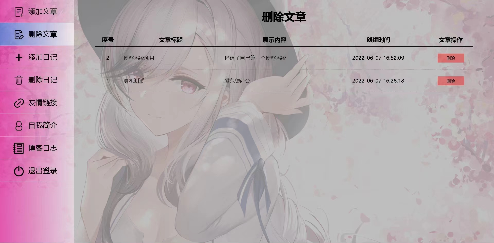
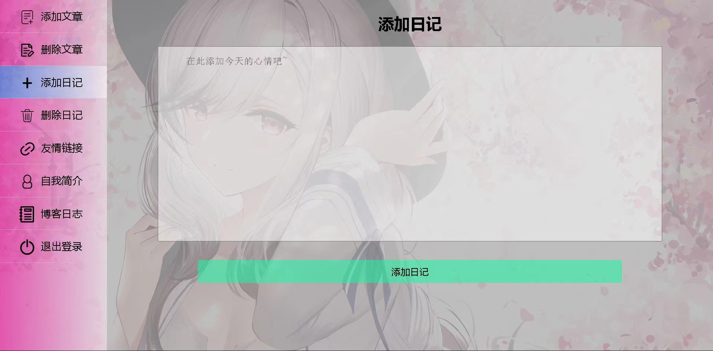
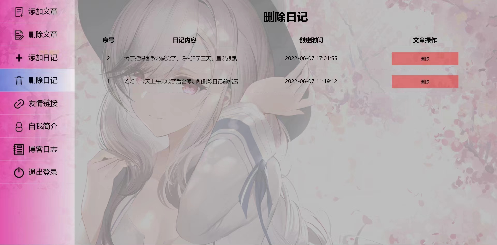
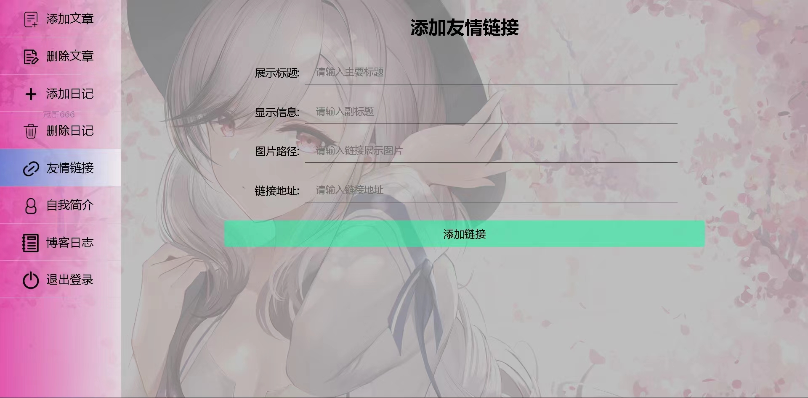
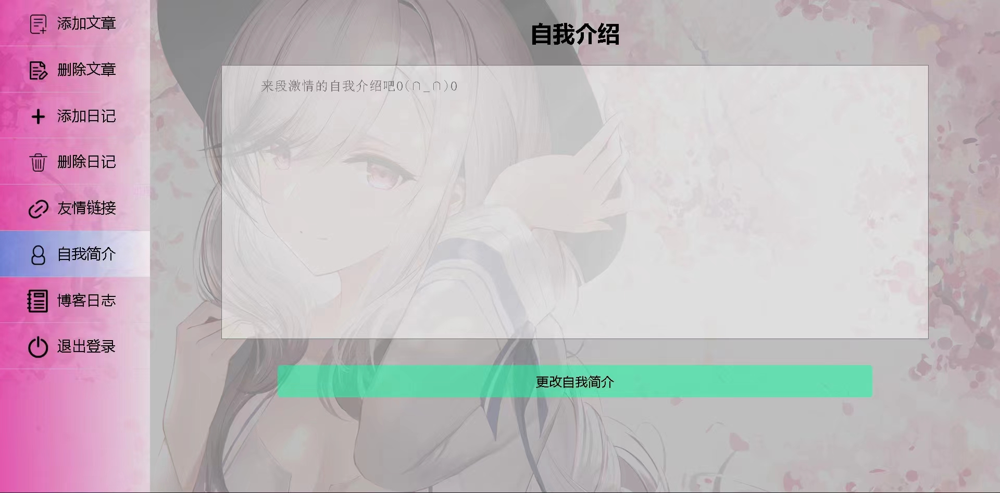

# 林风博客

## 项目简介

该项目为我的个人博客，全部为个人独立完成

出于安全考虑，配置信息已删除，请到js->config.js中配置必要的配置，否则将无法正常使用项目

> 注意：本项目没有存留数据库建表语句，且该项目已作废，即将更新为林风博客2.0
>
> [林风博客2.0地址](https://github.com/linfeng12138/linfeng-blog2-overivew)


## 技术选型

- 数据库：MySQL
- 前端：vue2（未使用脚手架）、axios、jQuery
- 后端：nodejs、express、mysql2
- 图床：阿里云OSS


## 运行项目

```bash
npm i

node blog-10001.js
# or
npm i -g pm2
pm2 start blog-10001.js
```


## 效果图片

### 前台效果图


### 后台效果图










